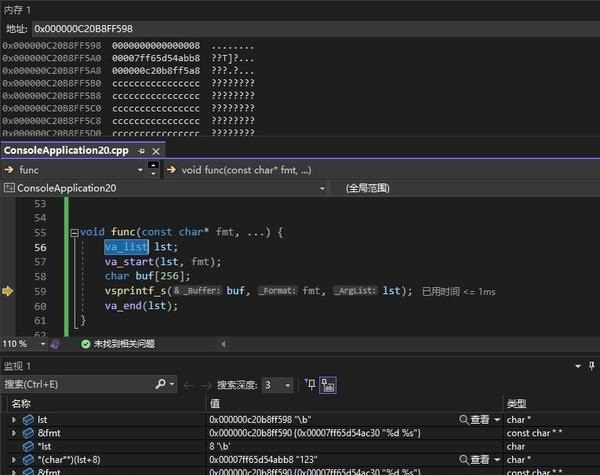

# 数组/结构体自动转换为可变参数 --va_list可变参数的另类用法

最近在写一个项目，因为需要将某些代码抽象出来，而抽取一段代码使其泛化就难免需要用模版，可变参数，各种多态来实现。这次遇到了一个需求：如何将数组转换为可变参数？

先看场景：


```
class Clazz
{
public:
    void printObject();
	virtual const char* getFormat();
	virtual const char** getStringifiedObject();
};

void Clazz::printObject() {
	char buf[256];
	sprintf(buf,getFormat(),/*getStringifiedObject() ? 如何传入可变参数 */);
    puts(buf);
}

```
一个类定义了基本的一些函数和过程，void printObject() 用于打印一些数据，由于打印格式或为了实现其他效果等原因，这个函数非常复杂，而各个模块又都需要用它，复制粘贴容易出错，因此打算将其抽取出来。

各个模块用到这个类时只需要修改打印字符串的格式和数据，其他需求不变，如果直接复制源代码然后修改格式和数据，则很费时费力，而且容易错改漏改。要改的代码穿插在代码中，容易让人眼花缭乱。

于是很自然地我们希望在使用这段代码时，只要明确地修改某几处代码即可。这样，使用者不需要阅读源码，而只需要简单地“设置”几处参数即可。常规的函数很好泛化，如果带可变参数呢？

注意到上面的类中几个get函数是virtual修饰的，这样设计是为了让子类重写这个函数，以达到“以重写函数代替设置”的效果。现在我们希望用到可变参数的地方也能这样实现。getFormat的函数体让用户重写来设置打印格式，getStringifiedObject用来返回某个对象属性全部转换为字符串的结果，便于打印。

先不管C++的模版和宏的方式是否能实现，因为模版和宏的实现方式会降低代码可读性。注意到有个函数叫

vsprintf，它的第三个参数是va\_list类型，利用va\_start宏，可以“神奇地"将可变参数打包成一个参数。

在查阅了相关资料后，发现声明va\_list arglst后，用va\_start(arglst,param)即可打包参数，而param的作用是确定要打包的参数的位置。又注意到在相关头文件中有typedef char\* va\_list ，这不得不让人怀疑va\_list的本质是个指针。

现在我们先做个实验：


```
void func(const char* fmt, ...) {
	va_list lst;
	va_start(lst, fmt);
	char buf[256];
	vsprintf_s(buf, fmt, lst);
	va_end(lst);
}

int main()
{
	func("%d %s", 8,"123");
}

```
运行这个程序，然后看va\_list lst中到底是什么。结果很显然，lst指向参数fmt的地址向后8字节的地址

借助VS的内存工具，发现va\_list lst所指的地址确实有我们传入的数据：数字8和字符串"123"的地址

  
所以，我们可以大胆地猜测，不妨把va\_list的地址改成任意一个可读地址，然后vsprintf函数会自发地根据这个地址向后读取数据。

现在回到这个场景：


```
class Clazz
{
public:
    void printObject();
	virtual const char* getFormat();
	virtual const char** getStringifiedObject();
};

void Clazz::printObject() {
	char buf[256];
	sprintf(buf,getFormat(),/*getStringifiedObject() ? 如何传入可变参数 */);
    puts(buf);
}

```
解决方案已经很明确了，将sprintf换成vsprintf，传入一个我们想让它读取参数的起始地址，即可让这个函数打印我们想要的内容。

这样一来，只要指定va\_list指向一片我们存储值的连续空间即可，可以是数组也可以是结构体。


```
class Clazz
{
public:
	Clazz() {};
	void printObject();
	virtual const char* getFormat() = 0;
	virtual const char** getStringifiedObject() = 0;
};

void Clazz::printObject() {
	char buf[256];
	vsprintf_s(buf, getFormat(), (char*)getStringifiedObject());
	puts(buf);
}

class Derived :public Clazz
{
public:
	Derived(){}
	~Derived() {}
	const char* getFormat() override {
		return "%s %s";
	}
	const char** getStringifiedObject() override {
		static const char* str[] = { "hello","world" };
		return str;
	}
};

```
上面的代码在实例化Derived类后调用printObject函数，即可将getStringifiedObject中的字符串数组中的内容打印出来。现在我们成功实现了数组到可变参数的转换。

利用这个原理，看看下面这段代码


```
struct Data
{
	int a;
	int b;
	double c;
	const char* d;
};

int main()
{
	Data dat = { 1,2,4.5,"abc" };
	char buf[256];
	vsprintf_s(buf, "%d %d %f %s",(char*)dat);
	puts(buf);
}

```
这段代码想打印结构体，但是实际上失败了，提示访问冲突。这是为什么?

  
现在我们再看这张图。实际上还有一个细节，就是我们传入的一个整型是占8字节的，而不是4字节。而结构体中int a int b是4字节的，Data结构体实际上占用了(64位程序时)4+4+8+8=24字节

但是格式"%d %d %f %s"预期要读取32字节的数据。所以当处理%s的打印时，读取到的位置已经越界，自然读到的指针是不确定的，于是引发了访问冲突。

所以，如果结构体中的变量是按预期对齐的，就可以用这种方法打印。这样就实现了结构体->可变参数的转换。

但是这种方法还是不推荐的，因为要想这样打印数据，结构体中的数据成员必须分别占用8字节，否则就会出现异常。

